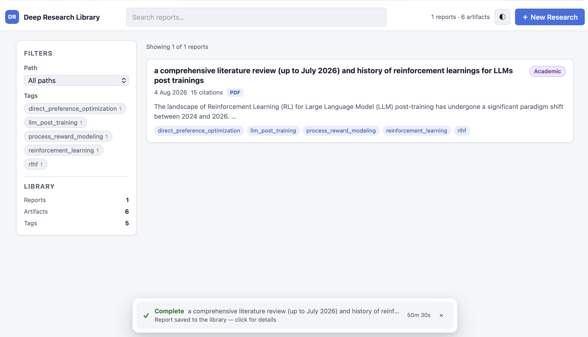

# Deep Research Agent

An async-first Python agent that performs **web, deep, academic, and single-source URL** research with the assistance of an LLM. Give it a question — it searches, reads, analyzes, and writes a structured report. Multi-modal LLM support enables vision-based comprehension of PDF figures.



```bash
# Quick start — the agent auto-routes based on your query
uv run deep-research "What is the capital of France?"
uv run deep-research "Survey recent advances in RLHF"
uv run deep-research "Summarize https://arxiv.org/abs/2401.12345"
```

---

## What this agent does for you

Deep Research turns an open-ended question into a finished, well-sourced report. Instead of a single search-and-summarize pass, it runs a deliberate research workflow:

- **Classifies your query** and picks the research strategy best suited to it.
- **Plans** multi-faceted questions into sub-questions it can research in parallel.
- **Searches and reads** the web — pages, papers, PDFs, blogs, and discussion — dispatching everything concurrently.
- **Critiques its own work**, chasing references and drilling into gaps it finds.
- **Writes a structured report** with citations and, for literature reviews, a BibTeX reference graph.
- **Archives everything** into a personal, searchable research library you can browse from a web UI.

The whole engine is built on raw `asyncio` — no LangChain, no LangGraph. Every page fetch, PDF download, and LLM call is dispatched concurrently.

## How it works

```
query → URL detected? → url_source path (analyze single URL + optional follow-up)
       → no URL        → classifier (one LLM call) decides:
                          ├─ quick   → 1 search + summarize (~5-15s)
                          ├─ deep    → planner → researcher → critic → writer loop
                          ├─ academic→ arxiv + Google Scholar seed → recursive citation graph mining (depth ≤ 3, papers ≤ 30)
                          └─ applied → blog-first research
```

PDFs are rendered page-by-page through a multimodal LLM (vision) for figure and equation comprehension. No external agent frameworks are required.

---
## AI Coding Acknowledgements

This software was built with the assistance of a combination of AI models, including **GLM 5.2**, **Qwen 3.8 Max Preview**, **DeepSeek V4 Flash** and **DeepSeek V4 Flash 0731**.

---

## Prerequisites

Before anything will run, you need:

| Requirement | Default / how to get it |
|---|---|
| **A running, OpenAI-compatible LLM server** (vLLM, llama.cpp, SGLang, Ollama, DashScope, ...) | Must expose `/v1` (chat completions + tool/function calling). vLLM is a good choice: `python -m vllm.entrypoints.openai.api_server --model <model> --served-model-name <alias>` |
| **The exact model alias from your config served on that endpoint** | `llm.text_model` and `llm.vision_model` must match a model/alias the server actually serves, e.g. `qwen3.5-122b`. A mismatch → every call 404s/400s. |
| **A vision-capable model** (for PDF figure comprehension) | Optional but recommended for the academic/deep paths. Can be the same text model routed via multimodal content blocks. |
| **Web search** (optional but recommended) | Tavily API key, or a local SearXNG instance |
| **Python 3.11–3.13** | `uv` installed — see below |
| **poppler** (for PDF vision) | `brew install poppler` / `apt-get install poppler-utils` |
| **Node.js LTS** (only if you use the browser tool) | `brew install node` |
| **pango + cairo** (for PDF report rendering) | `brew install pango cairo` / see the PDF section below |

> **The LLM server is the one hard prerequisite** — the agent is unusable without it. It must:
> - expose an OpenAI-compatible `/v1` chat-completions API,
> - serve the exact `llm.text_model` (and, for PDF vision, `llm.vision_model`) alias you set in `config.yaml`,
> - support **tool/function calling** (the researcher loop drives web search, page fetches, and PDF analysis through tool calls). Most vLLM/llama.cpp/Ollama/SGLang deployments do; a plain OpenAI endpoint does too.
>
> Verify before running:
> ```bash
> curl http://localhost:8000/v1/models | head
> # then a minimal chat call against /v1/chat/completions with your text_model alias
> ```
> If `llm.base_url`/model are wrong, you'll see `404`/`400`/connection errors on every request — see [LLM connection errors](#llm-connection-errors) below.

---

## Install

```bash
git clone <your-fork-url> deep_research
cd deep_research

# Install uv (if you don't have it)
curl -LsSf https://astral.sh/uv/install.sh | sh

# Install dependencies
uv sync
uv sync --extra dev   # pytest, ruff, mypy (optional)
uv sync --extra reddit # Reddit access (optional)
```

---

## Configure

Copy the example config and edit:

```bash
cp config.example.yaml config.yaml
```

### Minimal config (just an LLM)

```yaml
llm:
  base_url: "http://localhost:8000/v1"   # your LLM server
  api_key: "your-api-key"
  text_model: "qwen3.5-122b"
  vision_model: "qwen3.5-122b"
```

### Secondary LLM for reasoning (optional)

By default one endpoint serves everything. To offload text-heavy reasoning to a
separate model (e.g. a bigger or cheaper text-only model), add a `secondary`
block under `llm:`:

```yaml
llm:
  base_url: "http://localhost:8000/v1"   # primary (vision-capable) endpoint
  api_key: "your-api-key"
  text_model: "qwen3.5-122b"
  vision_model: "qwen3.5-122b"
  secondary:                              # optional
    enabled: true
    base_url: "http://localhost:8001/v1"  # secondary endpoint
    api_key: "your-api-key"
    model: "qwen3.5-122b"
    max_context_tokens: 131072
    timeout_s: 240
    roles: null                           # null = all text roles
```

When `secondary` is present and enabled:
- Text-role calls (planner / researcher / critic / writer / analysis /
  classifier / post) route to the secondary endpoint. `roles: null` routes
  **all** text roles there; an explicit list like `["planner", "critic"]`
  narrows it, with every other role staying on the primary.
- Any call carrying images — rendered PDF pages, HTML screenshots — always
  stays on the **primary** `vision_model`, so the secondary does **not** need
  vision capability.
- If a secondary call fails at runtime, it is retried once on the primary
  endpoint (with a warning), so long unattended runs stay alive.
- Omit the block entirely and everything runs on the single primary endpoint
  (the historical behavior).

Env var overrides for the secondary block:
`DEEP_RESEARCH_LLM_SECONDARY_BASE_URL`, `DEEP_RESEARCH_LLM_SECONDARY_API_KEY`,
`DEEP_RESEARCH_LLM_SECONDARY_MODEL`.

### With web search (recommended)

You need at least one search backend. Three options:

**Option 1 — Tavily** (cloud, no setup):

```yaml
search:
  primary: "tavily"
  tavily:
    api_key_env: "TAVILY_API_KEY"   # then: export TAVILY_API_KEY=your_key
```

Get a free API key at [tavily.com](https://tavily.com).

**Option 2 — Local SearXNG** (self-hosted, no API key needed):

See [docs/SEARXNG_SETUP.md](docs/SEARXNG_SETUP.md) for Docker and non-Docker setup instructions.

```yaml
search:
  primary: "searxng"
  searxng:
    url: "http://localhost:8080/search"
```

**Option 3 — Firecrawl** (cloud, second-priority fallback by default):

Get an API key at [firecrawl.dev](https://firecrawl.dev) (free tier: 1,000
credits; search costs 2 credits per 10 results), then:

```yaml
search:
  primary: "tavily"
  fallback_chain: ["firecrawl", "searxng"]
  firecrawl:
    api_key_env: "FIRECRAWL_API_KEY"   # then: export FIRECRAWL_API_KEY=fc-your_key
```

Without `FIRECRAWL_API_KEY` set, the backend is skipped silently and the
chain behaves as before. See
[docs/FIRECRAWL_INTEGRATION_PLAN.md](docs/FIRECRAWL_INTEGRATION_PLAN.md) for
design details.

The same key also unlocks an optional **Firecrawl scrape rescue** for
bot-blocked pages: when `fetch_page.firecrawl_rescue: true`, a page that
fails with bot detection / an HTTP error is retried through Firecrawl's
proxy-backed scraper (1 credit/page, capped by
`firecrawl_rescue_max_per_session`) before falling back to the Wayback
Machine. PDF URLs and 404s are never rescued.

### With Google Scholar (academic mode only, optional)

Enable Scholar seeding to cover non-arxiv venues (Nature, ACM, IEEE, conferences):

**Option 1 — Serper API** (recommended, cloud):

Get a free API key at [serper.dev](https://serper.dev), then:

```yaml
scholar:
  enabled: true
  primary: "serper"
```

```bash
export SERPER_API_KEY=your_key
```

**Option 2 — SearXNG with the `scholar` engine** (self-hosted, free):

Enable the `scholar` engine in your SearXNG `settings.yml` `engines:` block, then:

```yaml
scholar:
  enabled: true
  primary: "searxng"
  searxng:
    url: "http://localhost:8080/search"
```

And add `"scholar"` to `academic.seed_backends`:

```yaml
academic:
  seed_backends: ["arxiv", "scholar"]
```

The shipped `config.example.yaml` already enables Scholar and sets
`seed_backends: ["arxiv", "scholar"]`. If no Scholar credentials are
configured, the academic path falls back to arXiv-only seeds with a warning.

### Environment variables

| Variable | Purpose |
|---|---|
| `OPENAI_API_KEY` / `DEEP_RESEARCH_LLM_API_KEY` | LLM auth |
| `DEEP_RESEARCH_LLM_BASE_URL` | Primary LLM base URL (overrides `llm.base_url`) |
| `DEEP_RESEARCH_LLM_SECONDARY_BASE_URL` | Secondary LLM base URL (overrides `llm.secondary.base_url`) |
| `DEEP_RESEARCH_LLM_SECONDARY_API_KEY` | Secondary LLM auth |
| `DEEP_RESEARCH_LLM_SECONDARY_MODEL` | Secondary LLM model name |
| `TAVILY_API_KEY` | Tavily search |
| `FIRECRAWL_API_KEY` | Firecrawl search (second-priority fallback, optional) |
| `SERPER_API_KEY` | Google Scholar search (Serper backend) |
| `REDDIT_CLIENT_ID` / `REDDIT_CLIENT_SECRET` | Reddit search (optional) |
| `DEEP_RESEARCH_PG_DSN` | Postgres connection string (optional) |

---

## Use

### CLI

Auto-routing (default — the agent picks the best path for your query):

```bash
uv run deep-research "What is the capital of France?"
uv run deep-research "Survey recent advances in RLHF"
uv run deep-research "Summarize https://arxiv.org/abs/2401.12345"
uv run deep-research "https://blog.example.com/post — what are its gaps?"
```

Force a specific research path:

```bash
uv run deep-research --quick "who invented the wheel?"
uv run deep-research --deep "compare transformer architectures" --max-iterations 5
uv run deep-research --academic "RLHF safety" --max-depth 3 --max-papers 30 --dump-graph refs.bib
uv run deep-research --url-source "https://example.com/foo.pdf" "verify its claims"
```

### Checkpoint resume

The deep research path saves a JSON checkpoint after every iteration. If the process
is interrupted, rerunning the **same query** automatically detects the latest
checkpoint and resumes from where it left off — the planner is skipped and
already-completed sub-questions are not re-researched.

```bash
# Auto-resume: simply rerun the same query
uv run deep-research --deep "compare transformer architectures"

# Explicit run_id: resume a specific checkpoint (find the run_id in .cache/research_checkpoints/)
uv run deep-research --deep "compare transformer architectures" --run-id abc123def456
```

Requires `pdl.enabled: true` in config.yaml (enabled by default).

Output controls:

```bash
uv run deep-research "..." --out report.md --cite citations.json
uv run deep-research "..." --format json --out report.json
uv run deep-research "..." --quiet          # no live progress panel
uv run deep-research "..." --verbose        # debug logs + rich traceback
```

### Library CLI (personal research archive)

Every research run is automatically archived (enabled by default). Topic tags are
auto-extracted from the query and report by a lightweight LLM call. Browse your
personal library:

```bash
uv run deep-research-library ls                            # list recent reports (with timestamps + tags)
uv run deep-research-library find "transformer"            # full-text search
uv run deep-research-library show <artifact_id>            # artifact details
uv run deep-research-library tag <id> <tag>                # add a tag
uv run deep-research-library tag --remove <id> <tag>       # remove a tag
uv run deep-research-library tag --list <artifact_id>      # list tags for an artifact
uv run deep-research-library tag --rename-old <o> --rename-new <n>  # rename a tag globally
uv run deep-research-library rename <run_id> "New name"    # rename a research
uv run deep-research-library merge <id1> <id2> [--name "Combined"] [--delete-sources]  # merge reports
uv run deep-research-library add-source <run_id> <url>     # analyze a URL into an existing research
uv run deep-research-library stats                         # library statistics
uv run deep-research-library delete <run_id_prefix>        # delete a single report
uv run deep-research-library rm-artifact <artifact_id>     # delete one archived document (PDF/HTML + analysis)
uv run deep-research-library rm-artifact --arxiv <id>      # ... by arXiv id
uv run deep-research-library rm-artifact --url <url>       # ... or by source URL
uv run deep-research-library prune --older-than 90         # prune old reports
uv run deep-research-library export-bibtex refs.bib
uv run deep-research-library refresh                       # refresh stale artifacts
uv run deep-research-library glossary                      # list all glossary entries
uv run deep-research-library glossary --find "transformer" # full-text search
uv run deep-research-library glossary --term RLHF          # detail view of one term
uv run deep-research-library glossary --filter-tag "nlp"   # filter by domain tag
uv run deep-research-library glossary --out glossary.json  # export as JSON
```

**Merge, rename & attach** — keep your personal library tidy as topics evolve:

- `rename <run_id> "New name"` — update a research's display name (the web UI
  has a Rename button on the report page).
- `merge <run_id1> <run_id2> [more...] [--name "Combined"] [--delete-sources]` —
  combine two or more related researches into a single unified report. An LLM
  synthesizes the sources into one coherent report (deduping citations and
  merging tags); a deterministic stitch is used if the LLM call fails. Source
  reports are kept and tagged `merged` unless `--delete-sources` is passed, in
  which case their analyses are reassigned to the merged report before they are
  deleted. The web UI has a "Merge with…" panel on the report page.
- `add-source <run_id> <url>` — when you find a relevant paper/document/blog
  after the fact, fully analyze it (reusing the url_source pipeline, including
  PDF vision) and attach it to an existing research: the analysis is recorded
  against that research, a "Added source" section is appended to its report,
  and its citation is added to the references. The web UI has an "Add source"
  button on the report page (runs as a tracked job with live progress).
  Sources the agent scores as off-topic for the research (relevance below
  `url_source.attach_relevance_threshold`) are refused with a reason unless you
  pass `--force`.
- `rm-artifact <artifact_id>` (or `--arxiv <id>` / `--url <url>`) — remove a
  single misclassified document (its PDF/HTML + analysis) from the personal
  library, even when it was never part of a report. The web UI has a per-
  reference **Remove from library** button on the report page and a standalone
  **Artifacts** page (`#/artifacts`) that lists every archived document with a
  Delete button.

### Web UI (library browser)

A zero-dependency FastAPI + vanilla-JS web app for browsing the personal
library: search and filter reports by tag or path, read reports as rendered
markdown with a table of contents and a structured references panel (one-click
links to arXiv / PDF / DOI / original URLs), manage tags, download the
archived PDF or markdown, and kick off new research from the browser with
live progress — a bottom taskbar shows the running job (spinner, current
phase, elapsed time) and clicking it opens a dismissable detail dialog with
the full progress feed:

```bash
uv run deep-research-web
# open http://127.0.0.1:8080
```

The report page also supports **Rename** (edit the research's title),
**Add source** (paste a URL to fully analyze and attach it to this research —
runs as a tracked job), and a **Merge with…** panel to combine it with other
reports into one unified research (optional new name, optional delete
sources).

Or run the server directly:

```bash
uv run uvicorn deep_research.webui.app:app --host 127.0.0.1 --port 8080
```

Notes:

- Binds to `127.0.0.1` by default. The Dockerfile runs the web UI on
  `0.0.0.0:8080` so the port can be forwarded.
- **Pause & resume**: running research jobs can be paused from the UI at
  per-iteration checkpoint granularity and resumed later from where they left
  off. Jobs live in memory, so a server restart drops running jobs — but their
  checkpoints survive on disk, and the UI **restores them automatically as
  resumable paused jobs** after a restart, so an interrupted run is never lost.
  Cancel abandons the job and discards its checkpoint.
- Only one research job runs at a time; the UI disables Start while one is running.
- The frontend is plain ES modules with no npm or build step. Interactive API
  docs are available at `/docs`.

Refresh scheduler (daemon that auto-refreshes upstream URLs):

```bash
uv run deep-research-scheduler
```

### As a Python library

```python
import asyncio
from pathlib import Path
from deep_research import run_research, AgentTopConfig

config = AgentTopConfig.load_yaml("config.yaml")

async def main():
    report = await run_research("Survey RLHF methods", config)
    print(report.markdown)
    Path("report.md").write_text(report.markdown)

asyncio.run(main())
```

`run_research()` accepts optional `path_override` ("quick" / "deep" / "academic" / "url_source") and `progress` for streaming status updates.

### FastAPI microservice

The web UI above is the recommended way to use the agent over HTTP. A minimal
programmatic microservice (`POST /research` → report markdown/citations) is
also available:

```bash
uv run uvicorn deep_research.microservice:app --host 127.0.0.1 --port 8080

# POST /research with {"query": "...", "config_path": "config.yaml"}
```

Or run the web UI (library browser + new research) in Docker:

```bash
docker build -t deep-research .
docker run -p 8080:8080 deep-research
```

---

## Routing paths in detail

| Path | What it does | Best for |
|---|---|---|
| **quick** | Single web search + summarize top 3 results. ~5–15s. | Factual questions, "what is X" |
| **deep** | Planner decomposes query → parallel researcher tools → critic loop → final writer. Researchers can dynamically refine the plan mid-loop (chase references, drill into subtopics). | Multi-faceted questions, survey requests |
| **academic** | arxiv + Google Scholar seed → recursive citation graph (depth ≤ 3, ≤ 30 papers) → synthesis + BibTeX. Non-arxiv venues (Nature, ACM, IEEE, conferences) covered via the Scholar backend. | Literature review, "what does the literature say" |
| **url_source** | Classify URL → fetch (arxiv/pdf/html) → analyze_source LLM → optional follow-up deep research. | "Summarize this paper", "verify this blog" |
| **applied** | blog_search first → fetch top blog posts → synthesize practical report. | Implementation questions, "how do I build X" |

---

## Getting the best results

### Choosing a mode

| You want... | Mode |
|---|---|
| Paper-level provenance: "state of the art", literature reviews, BibTeX + citation graph | `--academic` |
| Broad multi-source answers mixing papers, blogs, docs, news, and discussion | `--deep` |
| Both: a paper spine **and** wide coverage | Run academic first, then deep (recipe below) |

The classifier auto-routes by default, but for important questions force the
mode explicitly so the pipeline (and its budget) is deterministic.

### Individual modes

Academic — literature-focused, bounded by `academic.max_papers` (30 in the
shipped example config):

```bash
uv run deep-research --academic "RLHF safety" --max-papers 30 --dump-graph refs.bib
```

Deep — multi-source, grows as breadth × iterations:

```bash
uv run deep-research --deep "RLHF safety" --max-iterations 4
```

### Recommended combination: academic spine → deep breadth

Every academic run archives per-paper analyses to the personal library, and
every deep researcher queries that library *before* going to the web. That
makes the two modes compose into a two-pass recipe:

```bash
# Pass 1 — build the citation spine (papers only)
uv run deep-research --academic "RLHF safety" --max-papers 30 --dump-graph refs.bib

# Pass 2 — wide multi-source coverage; researchers recall pass-1 analyses
# and only research the delta (automatic with pdl.enabled: true)
uv run deep-research --deep "RLHF safety" --max-iterations 4
```

Pass-2 researchers see the pass-1 paper summaries and key findings as "prior
research from the library" and are told to avoid re-fetching known ground, so
the deep report extends the paper foundation instead of duplicating it.

### Configuration knobs that matter most

The shipped `config.example.yaml` is a "rich results" preset. The levers with
the largest effect:

| Knob | Default | Recommended | Effect |
|---|---|---|---|
| `academic.seed_backends` | `["arxiv"]` | `["arxiv", "scholar"]` | Covers non-arxiv venues (Nature, ACM, IEEE, conferences) |
| `academic.max_papers` | 15 | 25–30 | More papers per survey |
| `academic.max_depth` | 2 | 3 | Deeper reference chains |
| `academic.seed_count` | 5 | 8–10 | Better seed diversity |
| `agent.max_subquestions` | 6 | 8–10 | Wider deep-mode coverage |
| `agent.max_iterations` | 3 | 4–5 | More critic gap-following rounds |
| `agent.max_citations_per_researcher` | 10 | 10 | Caps sources a single researcher may return; keeps the bibliography relevant |
| `agent.deep_analysis_max_papers` | 3 | 3–5 | Critic-selected full PDF analyses per deep run (0 disables) |
| `academic.seed_relevance_gate` | on | on | Batch LLM pre-filter of seed candidates; off-topic seeds never consume `max_papers` slots or library storage |
| `agent.deep_analysis_relevance_threshold` | 0.5 | 0.5 | Deep-path papers scored below this are not archived to the library |
| `url_source.attach_relevance_threshold` | 0.4 | 0.4 | `add-source` refuses sources scored below this against the research (override with `--force`) |
| `search.tavily.search_depth` | basic | advanced | Better search recall (2 credits/call) |

Keep `academic.key_reference_threshold` at `0.7`: it is the guardrail that
keeps off-topic keyword-overlap papers out of the synthesis and citation graph.

### Budget and cost notes

- Deep-mode cost multiplies: sub-questions × iterations × sources. Raising
  `max_subquestions` or `max_iterations` grows runtime and LLM cost roughly
  linearly per dimension.
- Keep the turn/timeout math consistent: `researcher_max_turns ×
  llm.timeout_s` must stay comfortably below `researcher_timeout_s`
  (16 × 240s = 3840s, leaving headroom for tool I/O inside 5400s).
- `tavily.search_depth: "advanced"` costs 2 credits per call.
- Firecrawl search costs 2 credits per 10 results; free keys ship a
  non-renewable 1,000 credits. Set `search.firecrawl.max_calls_per_session`
  to cap spend per run when using it as a fallback.
- Firecrawl scrape rescue (`fetch_page.firecrawl_rescue`) costs 1 credit per
  rescued page and is capped by `firecrawl_rescue_max_per_session` (default
  20). It only fires for bot-blocked / HTTP-error pages, never for every fetch.
- PDF vision is the most expensive academic step (one vision call per paper
  with rendered pages). Disable `pdf_vision.enabled` when speed matters more
  than figure comprehension.
- `--max-iterations` applies to deep; `--max-depth` and `--max-papers` apply
  to academic — raising the wrong flag has no effect.

---

## Personal Digital Library

By default, every research artifact is archived to `.deep_research_library/`:

- **Content-addressable dedup**: same PDF fetched twice → stored once
- **SQLite metadata DB**: reports, analyses, tags, glossary, citation edges, full-text search
- **Postgres backend**: set `pdl.storage.backend: "postgres"` with `DEEP_RESEARCH_PG_DSN`
- **Refresh daemon**: `deep-research-scheduler` probes upstream URLs for changes
- **Glossary**: dedicated post-synthesis LLM extraction (JSON-only prompt, `response_format=json_object`), cross-run dedup, FTS5 search. Export via `--glossary-out` on the main CLI or `deep-research-library glossary --out glossary.json`.
- **Cited-PDF archiving**: with `pdl.archive_cited_arxiv_pdfs: true`, every run downloads and archives the PDFs for citations that carry an arXiv ID, so the web UI's **arXiv** reference button opens the library's local copy (labeled "arXiv PDF") instead of the upstream page. Papers without a local copy get a **Get PDF** button that downloads and archives them on demand.
- **HTML source archiving**: fetched blogs / web pages are archived as a rendered **PDF** (`pdl.archive_html_as_pdf`, on by default) via weasyprint; if the render is unusable they fall back to a **screenshot image** (`pdl.archive_html_image_fallback`) via the browser tool, and only if neither works is the fetched HTML text stored. `pdf_render_pages`' downscaled page images are never persisted — only the original PDF bytes.

PDF rendering uses weasyprint (falls back to xhtml2pdf if system deps missing).
Install native deps for best results:

| OS | Command |
|---|---|
| macOS | `brew install pango cairo` |
| Debian / Ubuntu | `sudo apt-get install libpango-1.0-0 libpangoft2-1.0-0 libcairo2` |

---

## Troubleshooting

### poppler not installed

`pdf_render_pages` requires poppler for vision-mode PDF rendering.
Text extraction (pypdf / pdfplumber) works without it.

| OS | Install |
|---|---|
| macOS | `brew install poppler` |
| Debian / Ubuntu | `sudo apt-get install poppler-utils` |

Verify: `pdftoppm -v`

### browser tool fails (`npx not found`)

Install Node.js LTS: `brew install node` or https://nodejs.org/.
Or disable browser: `browser.enabled: false` in config.yaml.

### LLM connection errors

- Check `llm.base_url` is correct and the server is running
- Check `llm.api_key` matches what your endpoint expects
- Firewall blocking outbound HTTPS to the LLM host

### Empty academic citation graph

- Confirm `arxiv.enabled: true` in config
- If using Scholar seeds (`seed_backends: ["arxiv", "scholar"]`), confirm `scholar.enabled: true` and either `SERPER_API_KEY` is set or SearXNG has the `scholar` engine enabled
- Confirm LLM endpoint is reachable
- Re-run with `--verbose` to see per-paper analysis logs

### Live progress panel flickers in piped output

Pass `--quiet` / `-q` to disable the panel:

```bash
uv run deep-research --quiet "..." > report.md
```

---

## Reference

| File | Purpose |
|---|---|
| [`config.example.yaml`](config.example.yaml) | All config knobs with defaults |
| [`docs/PLAN.md`](docs/PLAN.md) | Full design document |
| [`docs/SEARXNG_SETUP.md`](docs/SEARXNG_SETUP.md) | Local SearXNG setup (Docker + non-Docker) |
| [`docs/IMPLEMENTATION_LOG.md`](docs/IMPLEMENTATION_LOG.md) | Progress tracker |

---

## License

MIT. See [`LICENSE`](LICENSE).

All Python dependencies are MIT / BSD / Apache-2.0 licensed. The `poppler` system binary (invoked via subprocess by `pdf2image`) is GPL-licensed but runs as an external process — it does not affect the license of this package.
